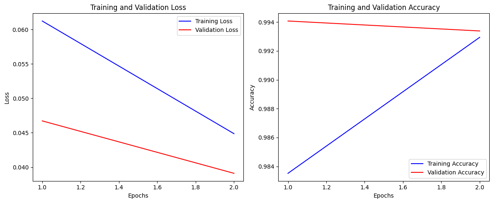

# Toxic Comment Classification using Deep Learning

## 📌 Overview
This project is a deep learning-based toxic comment classification system that detects harmful comments using three different models:
- Conv1D
- BERT
- DistilBERT

The system classifies comments into six toxicity categories using Natural Language Processing (NLP) techniques.

---

## 🚀 Features

- Multi-label toxic comment classification
- Comparison of Conv1D, BERT and DistilBERT
- Text preprocessing
- Model training and evaluation
- Flask deployment for real-time prediction

---

## 🛠 Technologies Used

- Python
- TensorFlow
- PyTorch
- Hugging Face Transformers
- Flask
- Pandas
- NumPy
- Scikit-Learn
- Google Colab

---

## 📂 Project Structure

```
BERT.ipynb
Conv1D.ipynb
DISTILLBERT.ipynb
README.md
```

---

## 📊 Models Used

- Conv1D
- BERT
- DistilBERT

---

## 📈 Results

| Model | Accuracy |
|--------|----------|
| Conv1D | 85% |
| BERT | 92% |
| DistilBERT | 90% |

---

## 📚 Dataset

Kaggle Jigsaw Toxic Comment Classification Dataset

---

## 👨‍💻 Author

Guru Charan

---

# 📸 Screenshots

## System Architecture


---

## Use Case Diagram


---

## Training & Validation Results



---

## BERT Label Distribution


---

## Toxic vs Clean Comments


---

# Flask Web Application

## Home Screen


---

## Toxic Prediction


---

## Threat Prediction


---

## Obscene Prediction


