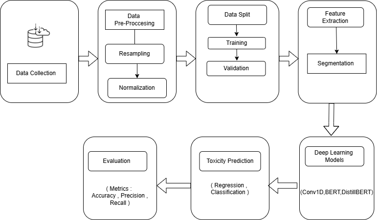
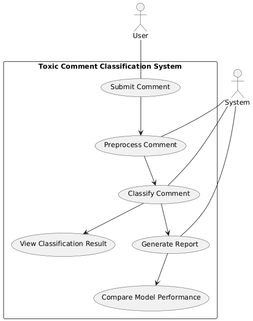
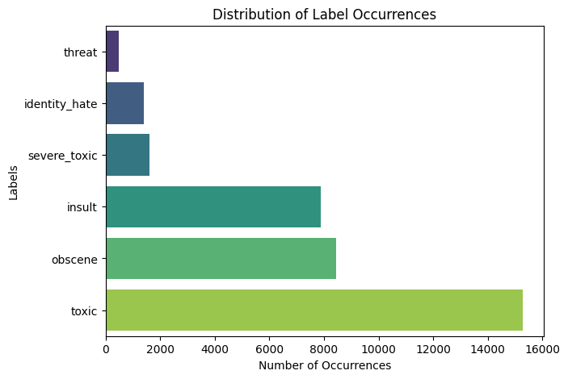
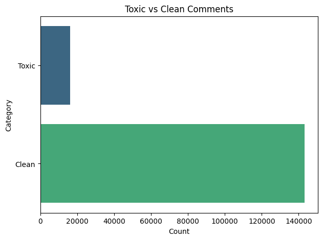
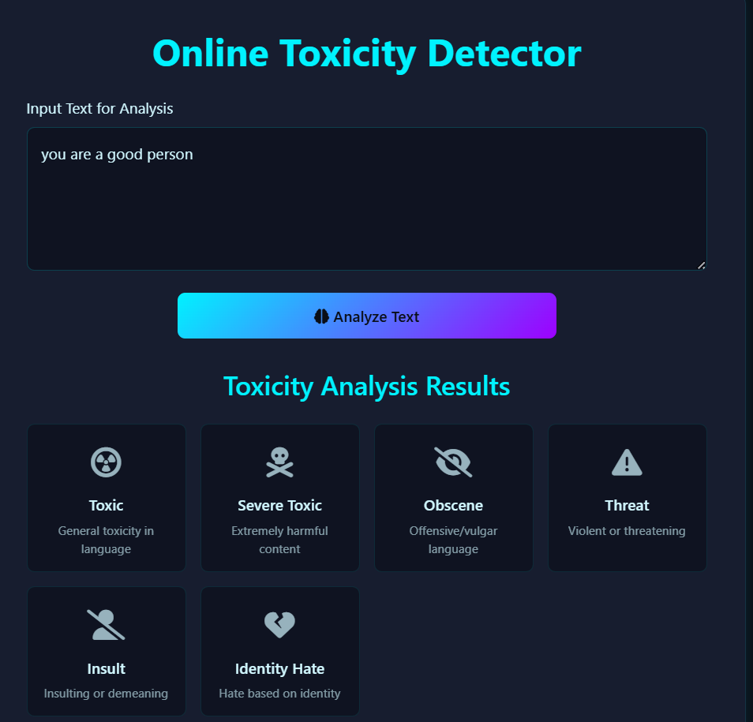
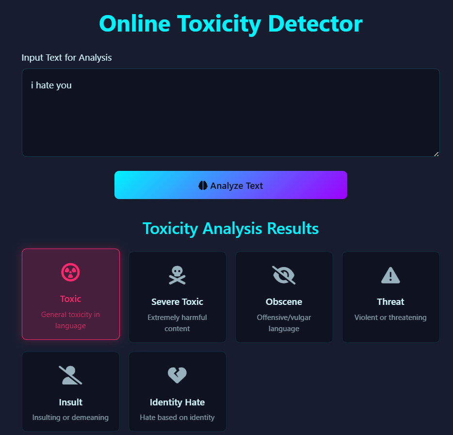
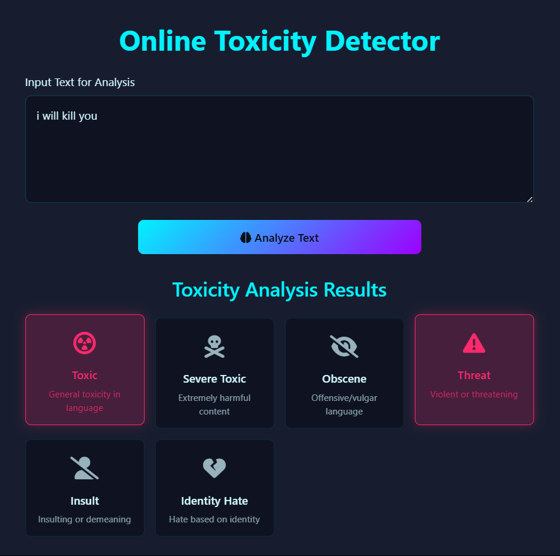
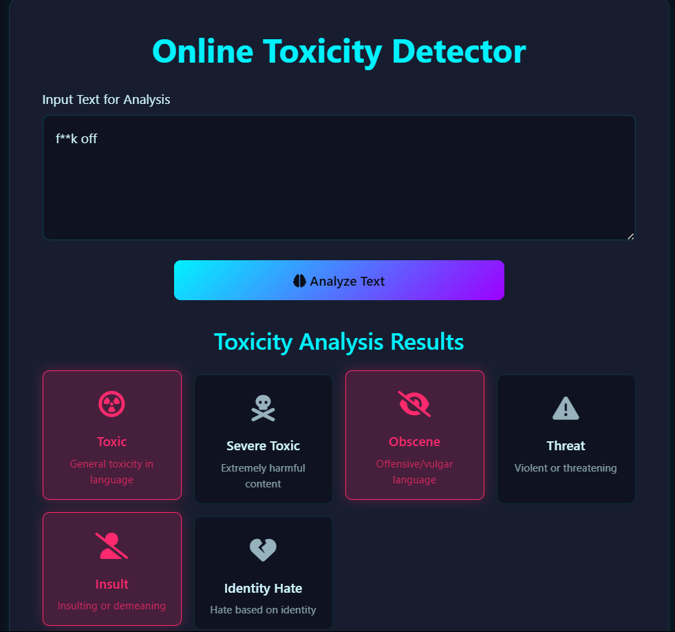

---

# 📸 Screenshots

## System Architecture

---

## Use Case Diagram

---

## Training & Validation Results

---

## Label Distribution

## Toxic vs Clean Comments

---

## Flask Application

### Home Screen

### Toxic Prediction

### Threat Prediction

### Obscene Prediction

